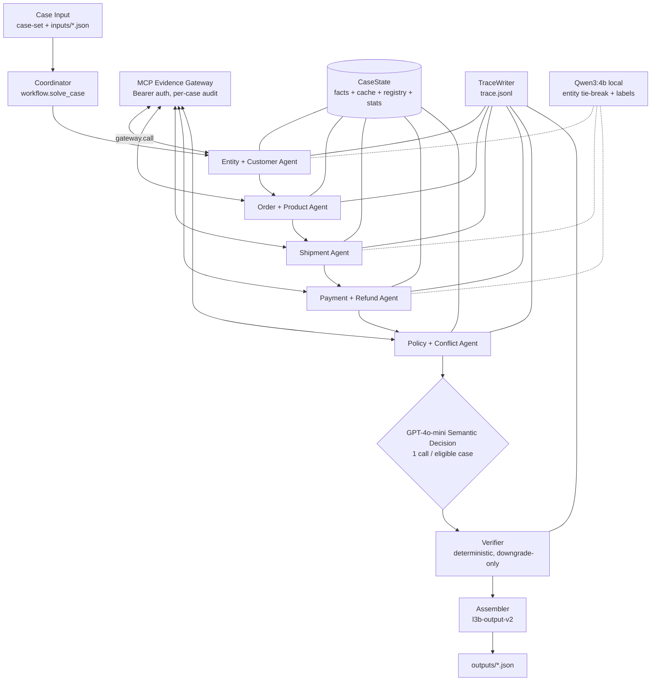

# L3B Architecture Record — Multi-Agent MCP + A2A Dispute Investigation

> Nguồn sự thật (source of truth): code hiện tại trong `src/student_agent/`,
> contracts trong `contracts/`, và artifacts quan sát được trong `outputs/` +
> `traces/trace.jsonl`. Tài liệu này mô tả implementation đúng như đang tồn
> tại. Không ghi prompt, chain-of-thought, hay secrets ở đây.

## 1. Mục tiêu (Goal)

Điều tra các dispute thương mại điện tử (dữ liệu dạng Brazilian-Olist) bằng
**MCP evidence có tính authoritative** và cho mỗi case tạo ra:

- một output JSON hợp schema (`day09-l3b-output-v2`) tại `outputs/<case_id>.json`,
- một trace quan sát được (`day09-trace-event-v1`) append vào `traces/trace.jsonl`,
- một gói submission ZIP (`manifest.json` + `trace.jsonl` + `outputs/*.json`).

Mục tiêu thiết kế:

- **correctness** — logic deterministic quyết định mỗi khi evidence đã đủ rõ;
- **evidence provenance** — mọi `evidence_ref` đều do server cấp, được đăng ký (registry) và liên kết trong trace;
- **deterministic behavior where possible** — cùng evidence cho cùng output;
- **semantic reasoning only where useful** — Model chỉ chạy khi có mơ hồ ngữ nghĩa thật sự;
- **low MCP call count** — Cache theo case cộng tool call lazy, có gate; Model escalation không bao giờ gây thêm MCP call;
- **graceful provider failure** — thiếu Ollama/OpenAI thì fallback deterministic;
- **auditable multi-agent coordination** — Coordinator giao task và mỗi Agent handoff đều ghi trong trace.

## 2. Sơ đồ kiến trúc (Architecture diagram)



Luồng Coordinator cho mỗi case (`workflow.solve_case`): entity resolution →
nếu unresolved thì output `needs_investigation` bảo thủ → ngược lại chạy
order/product → shipment → payment/refund (tuần tự; dừng an toàn khi không
resolve được order) → policy/conflict (+ GPT semantic decision) → assemble →
verify → return. Các specialist sau resolution chạy tuần tự, không concurrency.

## 3. Sở hữu component (Component ownership)

| Component | Sở hữu (Owns) | MCP tools (least privilege) | Emits / handoff |
|---|---|---|---|
| Coordinator (`workflow.py`) | thứ tự chạy, `ReasoningRouter` theo case, task/handoff events, gọi assembly + verification cuối | không gọi trực tiếp | `task_assigned` → agent, `handoff` ← agent |
| Entity/customer (`agents/entity_customer.py`) | candidate resolution, `customer_history`, chọn `customer_unique_id`, `orders` facts | `get_order` (mọi candidate), `get_customer_history` (hint hoặc single distinct customer) | entity result + `orders`/`customer_history` facts |
| Order/product (`agents/order_product.py`) | `items`, `products`, `sellers` facts; dựng `affected_entities` | `get_order_items` (luôn gọi), `get_sellers` (chỉ khi claim `late_delivery_seller` hoặc còn thiếu seller IDs), `get_product_context` (chỉ khi `investigation_scope.include_product_context`) | các ID set của affected entity |
| Shipment (`agents/shipment.py`) | shipment facts, verdict, `late_seller_ids`, `timeline_complete` | `get_shipment_summary` (mỗi resolved order) | verdict + reason từng order |
| Payment/refund (`agents/payment_refund.py`) | payment/refund rows, totals tính bằng Python, verdict, `payment_references` | `get_order_payments` (luôn gọi), `get_payment_timeline` (lifecycle topics, amount không parse được, hoặc marks pending/failed/refund), `get_refund_timeline` (topics refund-pending/failed hoặc tín hiệu refund trong rows) | totals + verdict |
| Policy/conflict (`agents/policy_conflict.py`) | primary/secondary issues, claim assessments, root cause, parties, actions, financial recommendation, `data_conflicts`, calibration, semantic review | `get_policy` (một lần mỗi case mỗi policy version, có cache) | `policy_decided` + toàn bộ decision facts |
| Verifier (`agents/verifier.py`) | hard invariants; chỉ downgrade, không bao giờ bịa | không (zero MCP calls) | `verification_completed` (`pass`/`downgraded`) |
| Assembler (`assemble.py`) | dựng đúng `l3b-output-v2`, dedupe/merge, chặn leak key nội bộ | không | dict cuối cùng |

### Quy tắc customer UID namespace (đúng như code)

`history_customer_unique_id()` chỉ đọc `customer_unique_id` /
`customerUniqueId` ở **top-level** của customer-history evidence và emit
nguyên văn. Thứ tự ưu tiên: UID từ history đã corroborate → customer ID của
order row authoritative → hint của case (nhánh ambiguous/not_found giữ hành
vi hint cũ). Không bao giờ transform hay tổng hợp ID (không sinh
`customer-*` từ `customer-row-*`). `related_order_ids` = history order IDs
cộng resolved IDs, cap 20.

### Agent result envelope (nội bộ, không bao giờ submit)

Mọi Agent trả về `{agent, status, facts, evidence_refs, confidence,
conflicts, warnings}` với `status ∈ {completed, partial, failed}` và `facts`
chỉ chứa domain của Agent đó. `assemble.py` loại bỏ mọi key nội bộ
(`assert_no_internal_leak`).

## 4. Shared state (`evidence.py`)

`CaseState` cho mỗi case (không bao giờ share giữa các case):

| Field | Nội dung |
|---|---|
| `case`, `case_id` | case document đầu vào |
| `entity` | status, claimed/candidate/resolved/rejected order IDs, customer UID, confidence |
| `facts` | payload theo owner: `orders`, `customer_history`, `items`, `products`, `sellers`, `shipment`, `payment`, `refund`, `policy` |
| `evidence_refs` | refs do server cấp, có thứ tự, dedupe, trong phạm vi case |
| `evidence_registry` | ref → `{tool_name, domain, result_hash}` |
| `cache` | `(tool_name, normalized args)` → envelope; `case_id` ngầm định |
| `conflicts`, `warnings` | bất đồng và suy giảm đã ghi nhận |
| `workflow` | `completed_agents` / `failed_agents` |
| `call_stats` | `{mcp_calls, cache_hits, by_tool{tool: count}}` — chỉ debug, không submit |

Ownership tuyệt đối: Agent chỉ đọc domain khác, chỉ ghi key `facts` của mình.

## 5. Luồng MCP evidence (MCP evidence flow)

```text
Python quyết định cần tool nào (gates ở dưới)
→ gateway.call(tool, case_id=..., **args)   # case_id luôn được inject
→ MCP evidence envelope {schema_version, evidence_ref, result_hash, domain, data, warnings?}
→ Contracts.validate_evidence (mcp-evidence-response-v1)
→ per-case cache (trúng cache trả envelope, đếm cache_hits, không emit trace event)
→ evidence_registry + facts đã normalize
→ specialist reasoning trên facts (không bao giờ đụng raw transport)
→ liên kết evidence_ref vào output + trace events tool_result_consumed
```

Quy tắc code enforce: đúng `case_id` mỗi call; không cache chéo case
(state object thuộc về một case); refs lưu nguyên văn, không sửa/tự tạo;
`tool_result_consumed` chỉ emit khi cache miss (consumer đầu tiên), nên trace
không bao giờ giả vờ có call; MCP hoàn toàn do Python điều khiển —
Reasoning layer không có quyền gọi tool và escalation không thêm MCP call nào.

Các tool đang dùng (từ `day09 mcp-tools`; schema do discovery, không đoán):
`get_order`, `get_customer_history`, `get_order_items`, `get_product_context`,
`get_sellers`, `get_shipment_summary`, `get_order_payments`,
`get_payment_timeline`, `get_refund_timeline`, `get_policy`.

## 6. Tool efficiency và cache (Tool efficiency and cache)

- Cache key: `(tool_name, sorted normalized args)`; mỗi identical call trong
  một case chạy tối đa một lần (`fetch_evidence`); `consume_evidence` chỉ
  thêm trace event khi miss.
- Hàng `get_order` đã fetch lúc entity resolution được reuse từ cache —
  specialist không bao giờ fetch lại.
- Lazy gates: sellers (claim seller hoặc thiếu IDs), product context (cờ
  scope), payment timeline (lifecycle topics / amount không parse được /
  marks pending-failed-refund), refund timeline (refund-state topics hoặc
  tín hiệu trong rows), policy (một lần mỗi version mỗi case).
- Sản lượng production quan sát được: 770 `tool_result_consumed` events /
  100 cases (≈7.7 mỗi case; call thất bại không emit event).
- `call_stats` (`mcp_calls`, `cache_hits`, `by_tool`) được unit test bao phủ
  với trần số call cho mỗi case mẫu.

## 7. Hybrid reasoning (rules → Qwen3:4b → GPT-4o-mini)

`src/student_agent/reasoning.py` (`ReasoningRouter`, một instance mỗi case;
usage counters sống trên instance và chết cùng case).

- **Layer 1 — deterministic Python.** IDs, timestamps, money arithmetic, hard
  lifecycle states, explicit policy mapping, source precedence, verifier
  invariants. Luôn thắng khi evidence đã conclusive.
- **Layer 2 — Qwen3:4b local** (`OLLAMA_BASE_URL` mặc định
  `http://localhost:11434`, `OLLAMA_MODEL` mặc định `qwen3:4b`; ≤10B).
  Qwen GIỮ VAI TRÒ ở: entity tie-break trong shortlist đã có evidence
  (adopt khi confidence ≥ 0.7 thành resolved 0.75); diễn giải label
  shipment/payment chưa rõ (adopt khi ≥ 0.7). Qwen KHÔNG tham gia policy
  semantic decision. Không cấu hình `think`/reasoning options; response phải
  là một JSON object duy nhất (tự strip fences).
- **Layer 3 — GPT-4o mini, PRIMARY semantic decision engine**
  (`OPENAI_API_KEY`, model mặc định `gpt-4o-mini`; thiếu key thì tắt layer).
  GPT sở hữu: `primary_issue`, `secondary_issues`, `case_status`, claim
  verdicts, responsible party types (+ IDs trong allowlist), ranked causes,
  action codes — đúng một call cho mỗi eligible case, qua Structured Output
  (`response_format json_object`), official SDK, timeout 60 s, 1 SDK retry.

Mọi output của Model đều qua strict validators (enum sets khép kín mirror
contracts; key sets chính xác; claim IDs thuộc input claims; selected order
IDs thuộc shortlist đã cho; party IDs thuộc allowlist evidence; cause codes
khớp primary/secondary). Output invalid bị reject, không bao giờ sửa.
Schema của Model về cấu trúc đã loại trừ amounts, IDs lạ, evidence refs,
timestamps, claims mới, và tool calls. Guard `_compatible_with_facts` còn
reject mọi primary đã adopt mà mâu thuẫn hard verdicts.

## 8. Điều kiện model-review chính xác (đúng như code)

| Agent | Qwen chạy khi | GPT chạy khi | Adopt khi |
|---|---|---|---|
| Entity | `ambiguous` + >1 strong candidate, không có ranker tường minh | Qwen invalid/fails/low-confidence | selected ID ∈ strong set và confidence ≥ 0.7 |
| Shipment | verdict `insufficient_evidence` có status text, hoặc `conflicting` | nguồn shipment mâu thuẫn, sau Qwen | verdict enum hợp lệ và confidence ≥ 0.7 (label) / 0.6 (conflict); verdict từ timestamp không bao giờ bị override |
| Payment | status tokens không có known mark nào | không bao giờ (lifecycle conflict đã resolve deterministic thành `capture_mismatch`) | payment state hợp lệ và confidence ≥ 0.7; totals tính lại deterministic |
| Policy | **GPT-first, Qwen bị bypass:** GPT configured + có resolved order + `captured_total` đã biết + policy rules tồn tại (hầu hết resolved case) | luôn là lựa chọn đầu (không qua Qwen) | `_compatible_with_facts` pass; claim overrides giữ refs/confidence-min deterministic; party IDs thuộc allowlist; action codes thuộc `_ACTION_MAP`; tiền tính lại deterministic từ rule của primary đã adopt |

Không Model nào chạy khi: outcome supported/unsupported sạch (entity/shipment/payment), entity authoritative đã resolved, shipment quyết bởi timestamp, lifecycle payment rõ ràng, order/product extraction. Provider outage → deterministic fallback cộng calibration penalty nhỏ khi review đã cần mà thất bại.

## 9. Calibration (`policy_conflict.calibrate_confidence`)

Thang từ 0.95 (hoặc `min(0.95, model_confidence)` — Model chỉ hạ điểm khởi
đầu): ambiguous entity −0.30; not_found −0.25; missing evidence −0.25;
unresolved conflict −0.20 (else any conflict −0.10); incomplete timeline
−0.20; policy ambiguity −0.15; partial evidence −0.10; partial claim −0.10;
topic↔evidence family conflict −0.05; review disagreement −0.05. Clamp
[0,1], rồi caps: ambiguous 0.60, insufficient primary 0.45,
needs_investigation 0.55, shipment-insufficient 0.50, unresolved 0.55
(any-conflict 0.80), unsupported primary 0.85. Làm tròn 3 decimals.

## 10. Thứ tự primary-issue precedence (đúng như code)

`duplicate_capture` → `capture_mismatch` → `refund_failed` →
`canceled`/`unavailable` (với captured > 0) → `seller_delay` →
`logistics_delay`/`lost`/`returned` → `refund_pending` →
`valid_split_payment` (reconciled multi-row + claim) → `unsupported_claim`
(có claims, không claim nào supported) → `insufficient_evidence`. Topic của
customer claim không bao giờ được copy; secondary issues lấy từ losers có
evidence-backing cộng claim topics đã supported (trừ refund asks), cap 10,
dedupe. GPT adopt primary mới vẫn phải qua guard tương thích facts ở trên.

## 11. Financial rules (đúng như code)

Chỉ Python, không bao giờ LLM arithmetic. `remaining = max(captured −
refunded, 0)`; `refundable_total_brl` = tiền còn khả dụng (`remaining`, khác
với grant); `recommended_refund_brl` = `min(policy entitlement, remaining)` —
bất biến `0 ≤ recommended ≤ refundable ≤ remaining`, Verifier enforce
(vi phạm thì downgrade). Một `refund_lines` entry cho mỗi resolved order
(`reason_code` từ policy action, cap 80 ký tự); `BRL` constant. Refund asks
map thành supported (grant bao phủ phần còn lại), partially_supported
(grant một phần), unsupported (grant zero + actionable status), hoặc
insufficient_evidence (needs_investigation / totals chưa biết). Grant mới
tính lại từ rule của primary đã adopt (GPT không quyết tiền).

## 12. Trace architecture

Lifecycle mỗi case: `case_received` (CLI) → `task_assigned`
(coordinator→agent) cho mỗi agent → `tool_result_consumed` (actor,
`tool_name`, `evidence_refs`) → `handoff` (agent→coordinator) →
`policy_decided` (`decision_code` = primary, policy refs, usage
`attributes` gồm cả `semantic_source`) → `verification_completed`
(`pass`/`downgraded`) → `case_finalized` (CLI). Quan sát được: 2370 events /
100 cases; đủ 7 event types; actors bao phủ cả sáu Agent cộng coordinator
và verifier.

- `event_id`: `evt_` + 24 ký tự random; validate unique cho mỗi submission.
- `attributes`: diagnostics đếm số model-usage (`qwen/gpt_calls`,
  `qwen/gpt_failures`, `qwen_to_gpt_escalations`, `gpt_input_tokens`,
  `gpt_output_tokens`, `estimated_gpt_cost`) cộng `semantic_source`
  (`"gpt"` hoặc `"deterministic_fallback"`). Artifacts hiện lưu predate field
  này nên trace đã lưu chưa có `attributes`.
- Cố tình không trace: prompts, chain-of-thought, secrets, raw provider
  responses, PII ngoài case IDs.

## 13. Output architecture (`assemble.py` + agents)

- `assessment`: primary/secondary/status từ policy facts (GPT-adopted hoặc
  deterministic fallback); confidence từ calibration.
- `affected_entities`: order/item/seller IDs từ order evidence;
  `payment_references` merge (row IDs của payment-agent trước, rồi
  order-derived), dedupe, cap 20; `shipment_ids` rỗng (shipment evidence
  không có source IDs — không bao giờ bịa).
- `entity_resolution` / `customer_context`: history-corroborated UID
  namespace trước, rồi order-row ID, rồi hint; `related_order_ids` từ
  history cộng resolved IDs (cap 20).
- `shipment_analysis` / `payment_analysis`: verdicts cộng late-seller IDs,
  timeline flag, và totals Python.
- `claim_assessments`: verdict từng claim với refs đã lọc registry (cap 5;
  GPT override verdict nhưng giữ refs/confidence-min deterministic).
- `root_cause_analysis`: GPT `ranked_causes` đã validate (fallback
  `PRIMARY.upper()` rank 1 + secondary rank 2); parties của GPT (IDs trong
  allowlist) hoặc deterministic với evidenced seller substitution.
- `evidence_refs`: thứ tự registry, dedupe, cap 30.
- `data_conflicts`: bất đồng claim-vs-evidence và refund-ask với code
  `authoritative_evidence_prevails` / `policy_prevails` (cap 5, ≥2 sources).
- `financial_resolution` / `resolution_actions`: policy action map sang
  `*_brl_*` / monitor / retry / reconcile / document strings (cap 8,
  dedupe; action code của GPT phải thuộc `_ACTION_MAP`).
- Nhánh unresolved entity (`build_unresolved_output`): document
  `needs_investigation` bảo thủ với scopes rỗng và refund zero.

## 14. Failure and fallback behavior

| Failure | Budget / behavior | Trace |
|---|---|---|
| MCP transport error | reconnect, retry theo case, `MAX_CASE_RETRIES = 2`; rồi abort run (resume chạy tiếp sau) | events của attempt dở dang còn lại; `case_finalized` chỉ khi success |
| MCP tool error / invalid args | không retry lỗi semantic; Agent ghi warning, hạ cấp thành partial/failed result | `tool_result_consumed` chỉ khi success |
| Qwen/Ollama failure | fallback sang GPT nếu có cấu hình, else deterministic (entity/shipment/payment) | usage failures counter |
| GPT failure/invalid/không configured | conservative deterministic fallback + calibration penalty khi review đã cần | usage failures counter; `semantic_source` = `"deterministic_fallback"` |
| Invalid model output | reject (không bao giờ sửa); guard rejection cộng review penalty | events deterministic giữ nguyên |
| Ambiguous entity | giữ `ambiguous`; không ép resolution | conflict `ambiguous_candidates` |
| Insufficient evidence | verdicts `insufficient_evidence` → `needs_investigation`, refund zero | capped confidence |
| Stale artifacts | resume không bao giờ wipe: outputs hợp schema được skip, trace append tiếp; muốn chạy sạch thì tự xóa `outputs/` + `traces/` | không trùng `case_finalized` |

## 15. Source precedence và conflicts (Source precedence and conflicts)

MCP transaction/event evidence có tính authoritative → facts suy ra
deterministic → customer claim (không bao giờ là ground truth). Bất đồng được
ghi nhận, không lặng lẽ bỏ: topic conflicts claim-vs-evidence và refund-ask
denials thành `data_conflicts` entries với selected source rõ ràng. Claims
đánh giá supported / unsupported / partially_supported /
insufficient_evidence dựa trên verdicts, totals, order state, và policy —
thiếu evidence thì `insufficient_evidence`, không bao giờ `unsupported`.

## 16. Security, safety, isolation

`.env` (Bearer team key) bị gitignore và không bao giờ đóng gói; gateway chỉ
gửi nó trong header `Authorization: Bearer`. `validate_artifacts` reject mọi
pattern `sk-team-…` trong outputs/traces. Không reuse evidence chéo case
(state + cache theo case). Không ref tổng hợp. Model không chạm tools,
tiền, IDs, hay evidence. Mọi output pass JSON-Schema validation trước khi
ghi; mọi trace event validate schema trước khi append.

## 17. Configuration (`.env.example`; defaults `ModelSettings` trong code)

| Variable | Required | Default / note |
|---|---|---|
| `COMPETITION_API_URL` | yes | absolute HTTP(S) URL |
| `COMPETITION_TEAM_API_KEY` | yes | định dạng `sk-team-…`, có validate |
| `MCP_ENDPOINT` | yes | absolute HTTP(S) URL |
| `OLLAMA_BASE_URL` | no | `http://localhost:11434` |
| `OLLAMA_MODEL` | no | `qwen3:4b` |
| `OPENAI_API_KEY` | no | rỗng thì tắt GPT layer |
| `OPENAI_MODEL` | no | `gpt-4o-mini` |

Không lưu secret thật trong repo.

## 18. Testing, validation, submission

- Static/unit: `ruff check src tests` (line-length 100; E,F,I,UP,B,SIM) và
  `pytest -q` — 7 test files: phase 1 (entity/cache/namespace), phase 2
  (specialists/gates), phase 3 (policy/finance/verifier/output),
  `test_hybrid_reasoning` (router/safety/caps/efficiency, tất cả mocked),
  `test_cli_resume` (skip/rerun/retry/no-reuse), `test_starter`
  (contracts), `test_release_safety`.
- Release-safety nuance: `test_release_safety` assert không có `case-set.json`,
  không có `inputs/*.json`, không có `outputs/*.json` trong repo — nó **fail
  local mỗi khi competition inputs đã tải về** (đúng trạng thái working copy
  hiện tại; không xóa dữ liệu user để thỏa mãn nó).
- Runtime: `day09 validate-inputs` (case-set shape + 100-file inventory) →
  `day09 mcp-tools` (auth + tool discovery) → `day09 run`
  (batch có resume) → `day09 validate` (100 outputs + trace events) →
  `day09 package --output dist/submission.zip`.
- ZIP layout: chỉ `manifest.json` + `trace.jsonl` + `outputs/<case_id>.json`;
  1 MB mỗi file, 12 MB uncompressed tổng; secrets bị reject.

## 19. Observed artifacts (hiện tại, read-only)

- 100/100 outputs tồn tại và đúng schema; case sạch điển hình
  (`L3B_CASE_002`): `valid_split_payment` / `no_action` / 0.8, reconciled
  totals 141.0, documented no-action, 7 refs. Case conflict
  (`L3B_CASE_010`): canceled primary kèm conflict entry
  `authoritative_evidence_prevails` tường minh.
- Trace: full lifecycle mọi case; lazy gating thấy rõ qua tool counts
  (payment timeline 40, refund timeline 20, sellers 10 trên 100 cases).
- Staleness warnings: outputs đã lưu vẫn mang order-row customer-ID
  namespace (code hiện tại ưu tiên history-corroborated UID), và trace đã
  lưu chưa có usage `attributes` (thêm sau run đó). Regenerate outputs
  trước mọi resubmission.

## 20. Known limitations và risks

- **Kiến trúc:** single-order resolution mỗi case; không concurrency;
  sessions theo case đánh đổi thêm discovery calls lấy isolation; rank-2
  causes và secondary issues rỗng khi chỉ evidence một fault duy nhất.
- **Grader uncertainty:** hidden semantic oracle (topic↔evidence divergence
  ở ~40 cases là judgment call đã biết — code đứng về evidence);
  numeric tolerances, set-coverage groups, và call budgets đều private.
- **Runtime/environment:** MCP transport instability (đã giảm bằng
  reconnect/resume); phụ thuộc Ollama local cho Layer 2 (vắng thì degrade
  sạch); phụ thuộc OpenAI optional (`openai>=1,<2` đã declare; thiếu key thì
  tắt Layer 3); semantic review không sửa được missing evidence và không bao
  giờ override hard facts.

## 21. Design rationale

Deterministic-first vì evidence đầy đủ và kiểm chứng được bằng máy;
specialized agents để least-privilege tool use và ownership rõ ràng;
`gateway.call` tập trung cộng per-case cache cho provenance và call budgets;
GPT semantic-decision một-call cho ambiguity mà rules không resolve nổi;
Qwen giữ ở entity/labels; deterministic verifier downgrade-only để failures
luôn an toàn và nhìn thấy được; escalation bounded cộng trace-linked,
counter-instrumented events để mọi decision đều auditable được.
